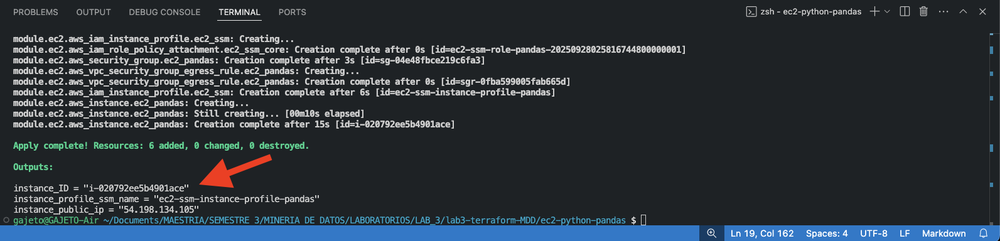
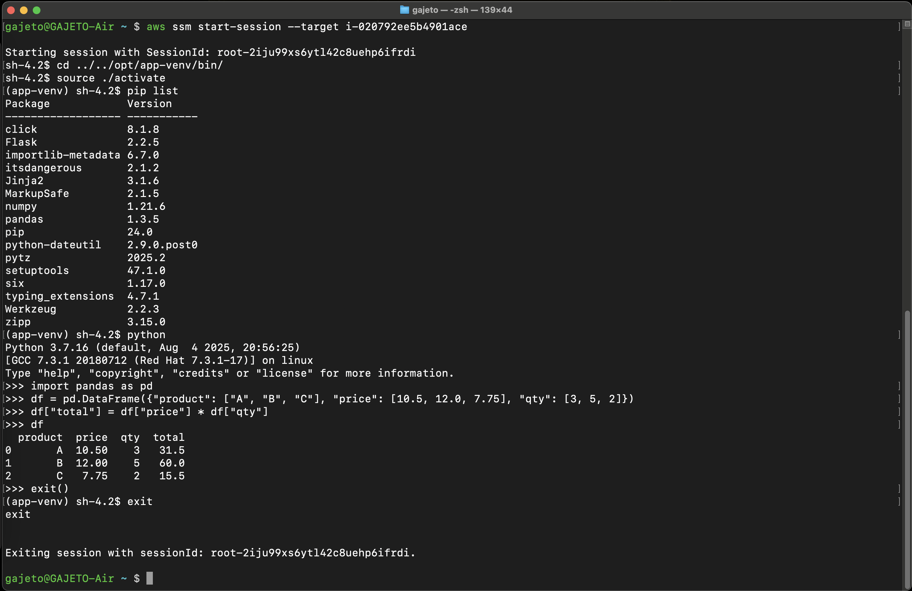
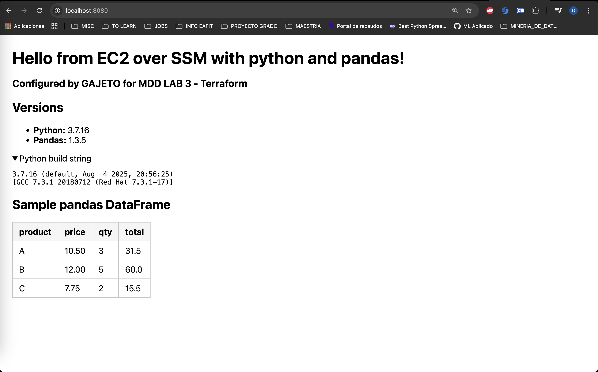

# EC2 con python y pandas

En esta tarea el objetivo era configurar una instancia de **EC2** que pudiera ser accedida mediante **SSM** y que al final se instalara **python** y la librería **pandas**.

## Instrucciones
Ubicado en la raiz del folder `ec2-python-pandas`, inicializar provider de la tarea (AWS):   
```bash
terraform init
```
Luego previsualizar los cambios con el plan de ejecución:
```bash
terraform plan
```
Seguidamente aplicar la configuración y esperar los outputs de los recursos configurados:
```bash
terraform apply
```

Al finalizar la configuración se muestran algunos datos de la instancia creada. Se debe copiar la salida de **instance_ID** para acceder a la misma mediante SSM.



## Validación
Una vez creada la instancia se puede inicar la conexión mediante el siguiente comando, especificando el argumento target con el valor copiado de **instance_ID**:
```bash
aws ssm start-session --target i-020792ee5b4901ace
```
En la sesión iniciada se accede al ambiente virtual donde se instaló pandas en la ruta:
```bash
cd ../../opt/app-venv/bin/
source ./activate
pip list
```
Con esto se valida la correcta instalación de pandas y se puede interactuar directamente si se activa el interprete python:



Para comprobar la correcta aplicación de los permisos de acceso SSM se puede incluso lanzar una web app con una prueba de funcionamiento de pandas mediante el siguiente comando, reemplazando el argumento target por el **instance_ID** y exponiendo el puerto 8080 en la red local.
```bash
aws ssm start-session \
  --target i-020792ee5b4901ace \
  --document-name AWS-StartPortForwardingSession \
  --parameters '{"portNumber":["8080"],"localPortNumber":["8080"]}'

```

Finalmente se puede consultar la dirección `http://localhost:8080` para observar la web app lanzada desde EC2:




