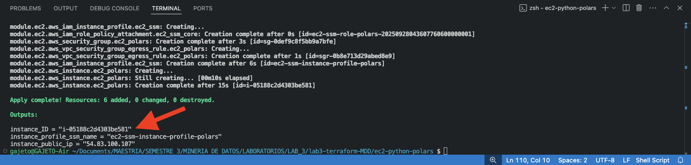
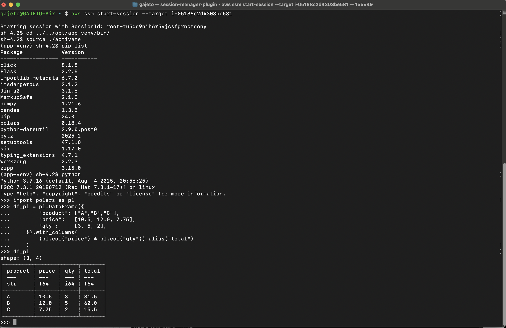

# EC2 con python y polars

En esta tarea el objetivo era configurar una instancia de **EC2** que pudiera ser accedida mediante **SSM** y que al final se instalara **python** y la librería **polars**.

## Instrucciones
Ubicado en la raiz del folder `ec2-python-polars`, inicializar provider de la tarea (AWS):   
```bash
terraform init
```
Luego previsualizar los cambios con el plan de ejecución:
```bash
terraform plan
```
Seguidamente aplicar la configuración y esperar los outputs de los recursos configurados:
```bash
terraform apply
```

Al finalizar la configuración se muestran algunos datos de la instancia creada. Se debe copiar la salida de **instance_ID** para acceder a la misma mediante SSM.



 

**Después de terminar la validación**, ejecutar el comando  `terraform destroy` para eliminar todos los recursos creados y no generar costos adicionales.


## Validación
Una vez creada la instancia se puede inicar la conexión mediante el siguiente comando, especificando el argumento target con el valor copiado de **instance_ID**:
```bash
aws ssm start-session --target i-020792ee5b4901ace
```
En la sesión iniciada se accede al ambiente virtual donde se instaló polars en la ruta:
```bash
cd ../../opt/app-venv/bin/
source ./activate
pip list
```
Con esto se valida la correcta instalación de polars y se puede interactuar directamente si se activa el interprete python:



