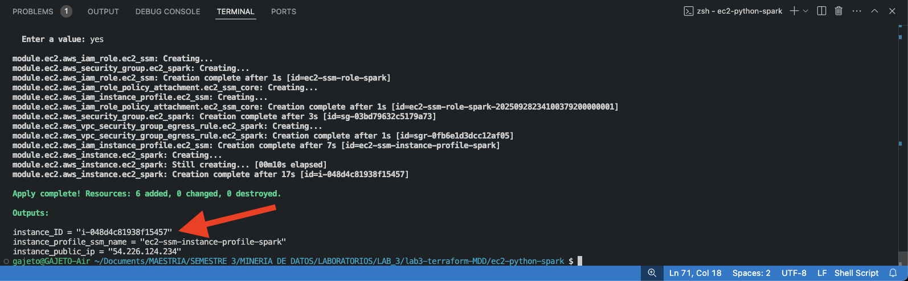
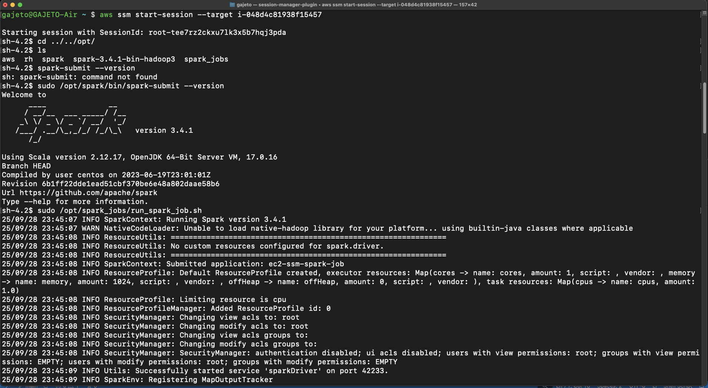
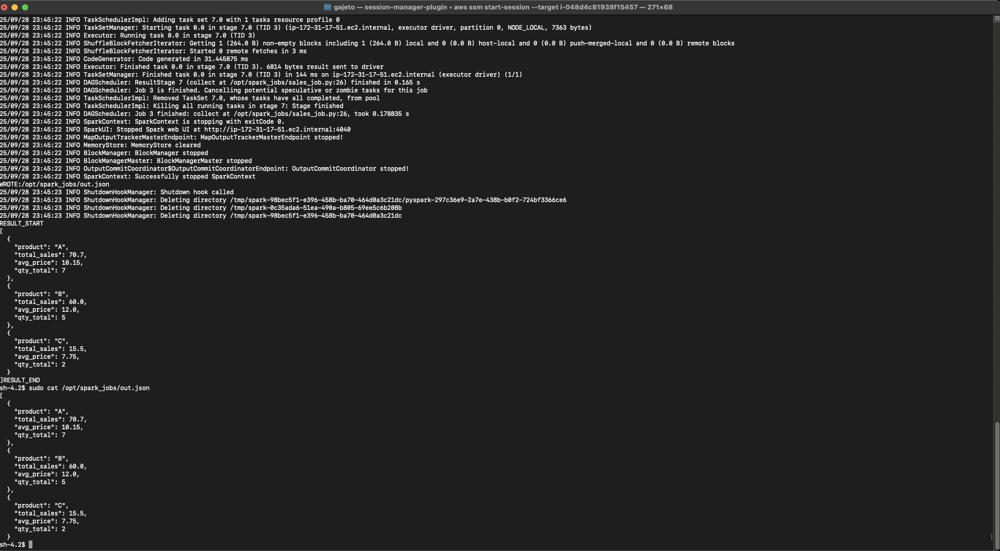

# EC2 con python y spark

En esta tarea el objetivo era configurar una instancia de **EC2** que pudiera ser accedida mediante **SSM** y que al final se instalara **python** y la librería **spark**.

## Instrucciones
Ubicado en la raiz del folder `ec2-python-spark`, inicializar provider de la tarea (AWS):   
```bash
terraform init
```
Luego previsualizar los cambios con el plan de ejecución:
```bash
terraform plan
```
Seguidamente aplicar la configuración y esperar los outputs de los recursos configurados:
```bash
terraform apply
```

Al finalizar la configuración se muestran algunos datos de la instancia creada. Se debe copiar la salida de **instance_ID** para acceder a la misma mediante SSM.



 

**Después de terminar la validación**, ejecutar el comando  `terraform destroy` para eliminar todos los recursos creados y no generar costos adicionales.


## Validación
Una vez creada la instancia se puede inicar la conexión mediante el siguiente comando, especificando el argumento target con el valor copiado de **instance_ID**:
```bash
aws ssm start-session --target i-048d4c81938f15457
```

En la sesión iniciada se valida la correcta instalación de spark y se puede interactuar directamente si se activa el interprete python:
```bash
sudo /opt/spark/bin/spark-submit --version
```



Una prueba rápida de ejecución de una tarea simple de Spark se realiza lanzando el PySpark job implementado en `user_data.sh`. Se hace de esta forma para tener un script disponible desde la configuración de la instancia. Para ejecutar el job se aplica el comando:
```bash
sudo /opt/spark_jobs/run_spark_job.sh 
```
La tarea guarda los resultados de ejecución en un archivo JSON que puede ser accedido mediante:
```bash
sudo cat /opt/spark_jobs/out.json 
```




