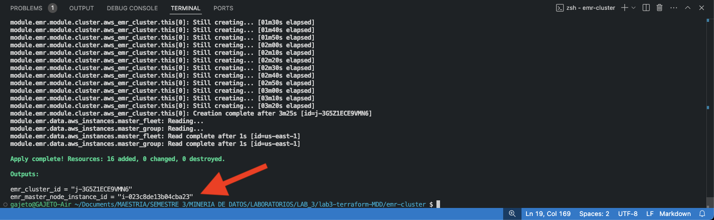
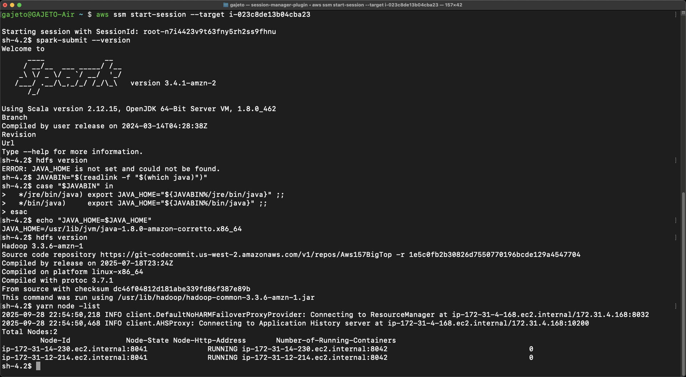
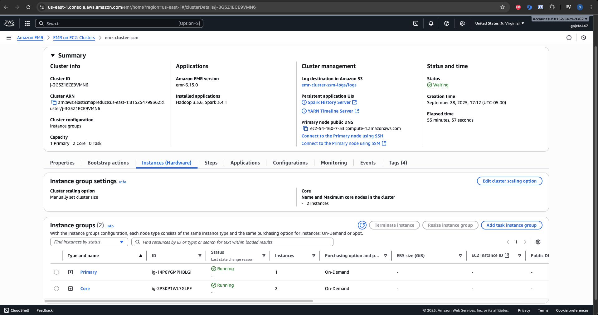
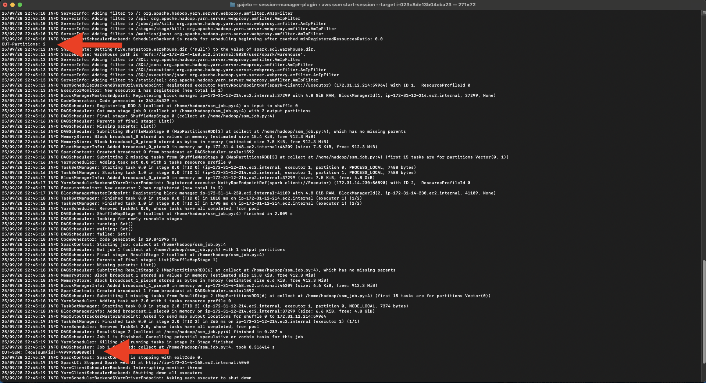

# EMR Cluster

En esta tarea el objetivo era configurar un cluster EMR que soportara computo distribuido. Para lograrlo se utilizó el módulo **emr** de Terraform Registry, definiendo un nodo maestro y dos esclavos. La conexión SSM se gestiona a través de los roles y políticas asociados a la instancia EC2 que aloja el nodo maestro.

## Instrucciones
Ubicado en la raiz del folder `emr-cluster`, inicializar provider de la tarea (AWS):   
```bash
terraform init
```
Luego previsualizar los cambios con el plan de ejecución:
```bash
terraform plan
```
Seguidamente aplicar la configuración y esperar los outputs de los recursos configurados:
```bash
terraform apply
```

Al finalizar la configuración se muestran algunos datos de la instancia creada. Se debe copiar la salida de **emr_master_node_instance_id** para acceder al nodo maestro mediante SSM.



 

**Después de terminar la validación**, ejecutar el comando  `terraform destroy` para eliminar todos los recursos creados y no generar costos adicionales.


## Validación
### Instalación
Una vez creada la instancia se puede inicar la conexión a la instancia del nodo maestro, especificando el argumento target con el valor copiado de **emr_master_node_instance_id**:
```bash
aws ssm start-session --target i-023c8de13b04cba23
```
En la sesión iniciada, se valida la correcta instalación de Spark y HDFS con los comandos:
```bash
spark-submit --version
hdfs version
```

<details>
  <summary>OJO: En caso de error <strong> ERROR: JAVA_HOME is not set and could not be found</strong></summary>
  <p>Definir correctamente ruta de JAVA_HOME </p>

  ```bash
  JAVABIN="$(readlink -f "$(which java)")"
  case "$JAVABIN" in
    */jre/bin/java) export JAVA_HOME="${JAVABIN%/jre/bin/java}" ;;
    */bin/java)     export JAVA_HOME="${JAVABIN%/bin/java}" ;;
  esac
  ```
</details>
<br>




También se comprueba desde la consola de AWS:



### Cómputo distribuido
Si se quisiera ejecutar un Spark job simple de prueba (PySpark) para evidenciar computo distribuido se aplican los comandos bash:

1. Generar una función pyspark formateada como string para ser usada por Hadoop para lanzar un job.
```bash
python_code=$(cat <<'PY'
from pyspark.sql import SparkSession, functions as F
spark = SparkSession.builder.appName("Interactive").getOrCreate()
print("OUT-Partitions:", spark.sparkContext.defaultParallelism)
print("OUT-SUM:",spark.range(1000000).selectExpr("sum(id)").collect())
spark.stop()
PY
)
```

2. Enviar el `python_code` como Hadoop user para que pueda ser procesado por EMR y luego imprimir los resultados en el shell del nodo maestro.
```bash
printf "%s" "$python_code" | base64 | \
sudo -u hadoop -i bash -lc 'base64 -d > /home/hadoop/ssm_job.py && spark-submit --master yarn --deploy-mode client /home/hadoop/ssm_job.py'
```

La salida del Spark job ejecutado muestra el paralelismo usado por el SparkContext (nodos esclavos) y la suma (distribuida) de un dataframe column con 1 millón de números enteros.




